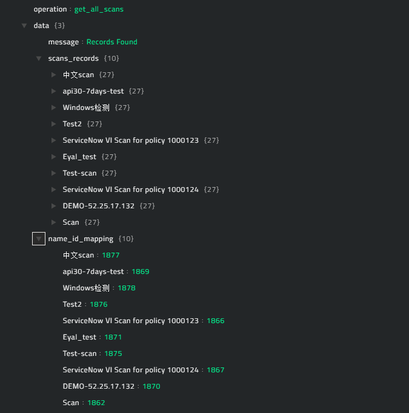
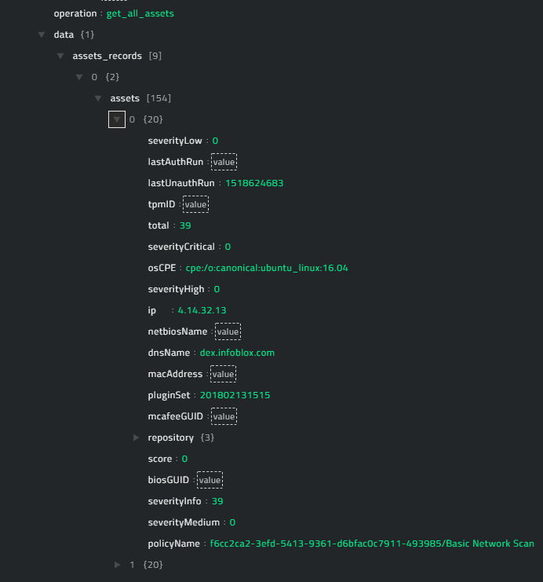
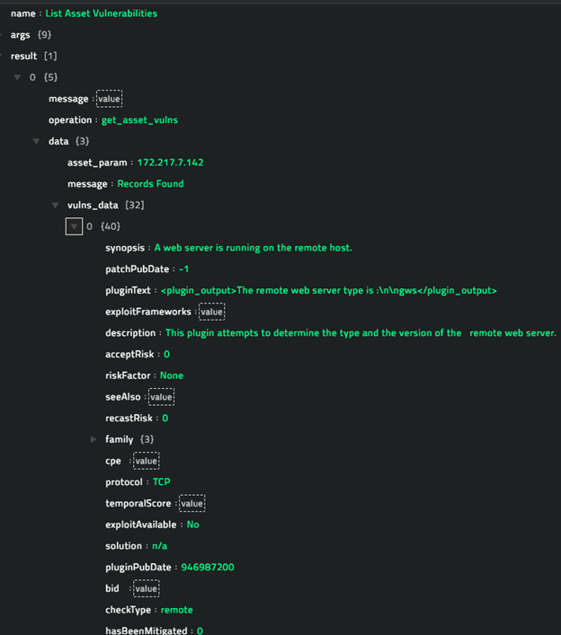

## About the connector

Tenable Security Center is a comprehensive vulnerability analytics solution that provides complete visibility into the security posture of your distributed and complex IT infrastructure. 

This document provides information about the Tenable Security Center connector, which facilitates automated interactions, with a Tenable Security Center server using CyOPs™ playbooks. Add the Tenable Security Center connector as a step in CyOPs™ playbooks and perform automated operations, such as retrieving a list and details of all the completed scans for a specified time duration, retrieving information about asset(s) that are associated with a specified scan, and retrieving information about the vulnerabilities associated with a particular asset. 

!!! Note  
		CyberSponse recommends that you create a separate API-enabled Tenable Security Center account for the Tenable Security Center connector and also allow multiple and parallel API sessions. This helps the Tenable Security Center connector perform API queries seamlessly, as the connector might simultaneously execute multiple API queries.

### Version information

Connector Version: 1.0.0

Compatibility with CyOPs™ Versions: 4.10.2-225 and later

Compatibility with Tenable Security Center Versions: 5.6.1 and later

## Installing the connector

All connectors provided by  CyOPs™ are delivered using a CyOPs™ repository. Therefore, you must set up your CyOPs™ repository and use the `yum` command to install connectors:

`yum install cyops-connector-security-center`

To update a  CyOPs™-provided connector use the following command:

`yum update cyops-connector-security-center`

To remove a  CyOPs™-provided connector use the following command:

`yum remove cyops-connector-security-center`

The process to write your own custom connector is defined in the `Building a custom connector` topic.

## Prerequisites to configuring the connector

- You must have the URL of the Tenable Security Center server to which you will connect and perform the automated operations and the credentials to access that server. 
- To access the CyOPs™ UI, ensure that port 443 is open through the firewall for the CyOPs™ instance.

## Configuring the connector

!!! Note  
		This procedure assumes that you are using CyOPs™ version 4.10.2. If you are using a different version of CyOPs™, such as CyOPs™ 4.9, then it is possible that the CyOPs™ UI navigation is different. Refer to the CyOPs™ documentation of that particular version for details about CyOPs™ navigation.

1. In CyOPs™, on the left pane, click **Automation** > **Connectors**.   
   On the `Connectors` page, you will see the `Tenable Security Center` connector.
2. To configure the connector parameters, click **Configure** and enter the required configuration details in the **Configurations** tab.  
   You must provide configuration parameters such as the URL of the Tenable Security Center server that you will connect to and perform automated operations and the API key to access that server.   
   For a complete list of configuration parameters, see the [Configuration parameters](#Configuration-parameters) section.  
   **Note**: You can add multiple configurations if you have more than one Tenable Security Center server instances in your environment. You must, therefore, specify a unique `Name` to identify each configuration in your environment.  
   If you have previous versions of a connector and you are configuring a newer version of that connector, with the same configuration parameters, then CyOPs™ fetches the configuration and input parameters of the latest available version of that connector. For example, If you have 1.0.0, 1.1.0, and 1.2.0 versions of the Tenable Security Center connector and you are configuring the 1.3.0 version of the Tenable Security Center connector, then while configuring the 1.3.0 version,  CyOPs™ will fetch the configuration and input parameters from the 1.2.0 version of the Tenable Security Center connector. You can review the configuration and input parameters, and then decide to change them or leave them unchanged. 
3. To save your configuration, click **Save**.  
   To view the list of actions that can be performed by the connector, click the **Actions**
   tab.  
   To view the playbook file that is bundled with the connector, click the **Sample Playbooks** tab. Refer to the [Included Playbooks](#Included-playbooks) section for details on the bundled playbooks. You can see the bundled playbooks in the **Automation** > **Playbooks** section in  CyOPs™ after importing the Tenable Security Center connector.  
4. (Optional) To check the connectivity to the Tenable Security Center server and validity of the credentials provided perform a health check, by clicking the **Refresh** icon that is present in the `Health Check` bar.  
   If all the details are correct and the Tenable Security Center server is available then the health check status displays as `Available`.  
   If any of the details are incorrect or the Tenable Security Center server is unavailable then the health check status displays as `Disconnected`.

### Configuration parameters

In CyOPs™, on the Connectors page, select the **Tenable Security Center** connector and click **Configure** to configure the following parameters:

| Parameter  | Description                                                  |
| ---------- | ------------------------------------------------------------ |
| Server URL | URL of the Tenable Security Center server to which you will connect and perform the automated operations. |
| Username   | Username used to connect to the Tenable Security Center server to which you will connect and perform automated operations. |
| Password   | Password used to connect to the Tenable Security Center server to which you will connect and perform automated operations. |
| Verify SSL | Specifies whether the SSL certificate for the server is to be verified or not.  By default, this option is set as `True`. |

**Note**: You can store passwords and other confidential data using the `Secrets` store provided in CyOPs™. When you store data in the `Secrets` store, users cannot see that data. However, they can use this data when required. For more information about the `Secrets` store, see *Configuring the Secrets store* in the "Administration" guide.

## Actions supported by the connector

The following automated operations can be included in playbooks and you can also use the annotations to access operations from CyOPs™ release 4.10.0 onwards:

| Function                   | Description                                                  | Annotation and Category                  |
| -------------------------- | ------------------------------------------------------------ | ---------------------------------------- |
| List Completed Scans       | Retrieves a list and details of all the completed scans based on the time duration, such as the last 24 hours, or last 3 days, that you specify. | search_scans   Investigation        |
| List Assets                | Retrieves information about asset(s) that are associated with a specified scan based on the scan name and scan ID that you specify. | get_endpoints    Investigation      |
| List Asset Vulnerabilities | Retrieves information about the vulnerabilities associated with a specified asset based on the IP/MAC/Hostname that you specify. | get_vulnerabilities   Investigation |

### operation: List Completed Scans

#### Input parameters

| Parameter       | Description                                                  |
| --------------- | ------------------------------------------------------------ |
| Completion Time | Specify the time duration for which you want to retrieve the list of all the completed scans. For example, if you choose Last 24 Hours, then the details of all the scans that were completed in the last 24 hours will be retrieved from the Tenable Security Center server.   Choose from the following options: Last Fetch, Last 24 Hours, Last 3 Days, Last 5 Days, Last 7 Days,  Last 15 Days, Last 25 Days, Last 30 Days, Last 50 Days, Last 60 Days, Last 90 Days, Last 120 Days, and Last 180 Days.   **Last Fetch** means the last time you have collected data from Tenable Security Center. **Note**: By default this is set to **Last 7 Days**. |

#### Output

The JSON output contains a list and details of all the completed scans for the time duration you have specified.

**Note**: The JSON response contains a `name_id_mapping` dictionary that contains the scan name and scan ID. This information is required when you want to fetch assets associated with a specific scan, You can fetch assets associated with a specific scan using the [List Assets](#List-Assets) step. You can also customize the JSON response as per your requirement.

Following image displays a sample output that contains a `name_id_mapping` dictionary:

### operation: List Assets

#### Input parameters

| Parameter        | Description                                                  |
| ---------------- | ------------------------------------------------------------ |
| Scan Information | Scan name and Scan ID based on which you want to retrieve associated asset(s).   By default this is set to `{{ vars.name_id_mapping }}`. |

#### Output

The JSON output contains information about asset(s) that are associated with a scan based on the scan name and scan ID that you have specified.

Following image displays a sample output:

### operation: List Asset Vulnerabilities

#### Input parameters

| Parameter       | Description                                                  |
| --------------- | ------------------------------------------------------------ |
| IP/MAC/Hostname | IP/MAC/Hostname for which you want to retrieve vulnerabilities. |
| Scan ID         | (Optional) ID of the scan based on which you want to retrieve vulnerabilities for the IP/MAC/Hostname you have specified. **Note**: If you provide the Scan ID then you must also provide the Scan Name.   This means that if you are providing scan information then you must provide both the Scan ID and the Scan Name. |
| Scan Name       | (Optional) Name of the Scan based on which you want to retrieve vulnerabilities for the IP/MAC/Hostname you have specified. **Note**: If you provide the Scan Name then you must also provide the Scan ID. |

**Note**: The Tenable Security Center connector first tries to pull the vulnerabilities information using the IP/MAC/Hostname that you have provided. If the connector fails to report vulnerabilities, only then will it utilize the Scan ID and the Scan Name to pull IP Address specific vulnerabilities from Tenable Security Center.

#### Output

The JSON output contains information about the vulnerabilities associated with a specified asset based on the IP/MAC/Hostname that you have specified. 

Following image displays a sample output:

## Included playbooks

The `Sample-Tenable Security Center-1.0.0`  playbook collection comes bundled with the Tenable Security Center connector. This playbook contains steps using which you can perform all supported actions. You can see the bundled playbooks in the **Automation** > **Playbooks** section in CyOPs™ after importing the Tenable Security Center connector.

- 1.1 List Completed Scan
    - 1.2 List Scan Specific Asset
        - 1.3 Handle Assets in CyOPs
- 2.1 Create Incident > List Asset Vulnerabilities
- 2.1 Update Incident > List Asset Vulnerabilities
    - 2.2 Handle Vulnerabilities in CyOPs

**Notes about the bundled playbooks**:

The 1.1, 1.2 and 1.3 playbooks fetch the latest and completed scan information and assets associated with each scan from Tenable Security Center. These playbooks also create and update the scan(s) and asset(s) record in CyOPs™ as per information retrieved from Tenable Security Center and builds relations among scans and asset records.

The 2.1 Create Incident > List Asset Vulnerabilities playbook collects all the vulnerabilities associated with specific assets from Tenable Security Center. This playbook gets triggered when a user creates an incident record and provide asset information, i.e. IP/MAC/Hostname of an asset, in the **Source** field. Ensure that the related asset record is present in CyOPs™ to execute this playbook successfully.

The  2.1 Update Incident > List Asset Vulnerabilities playbook fetches all vulnerabilities when a user adds or links one or more assets to an incident.

The 2.2 Handle Vulnerabilities in CyOPs playbook cleans up of stale vulnerability records, creates new vulnerabilities, and builds relations among vulnerabilities and assets.  

**Note**: Ensure that you clone the  `Sample-Tenable Security Center-1.0.0`  playbook collection before using the playbooks, since the sample playbook collection gets deleted during connector upgrade and delete.